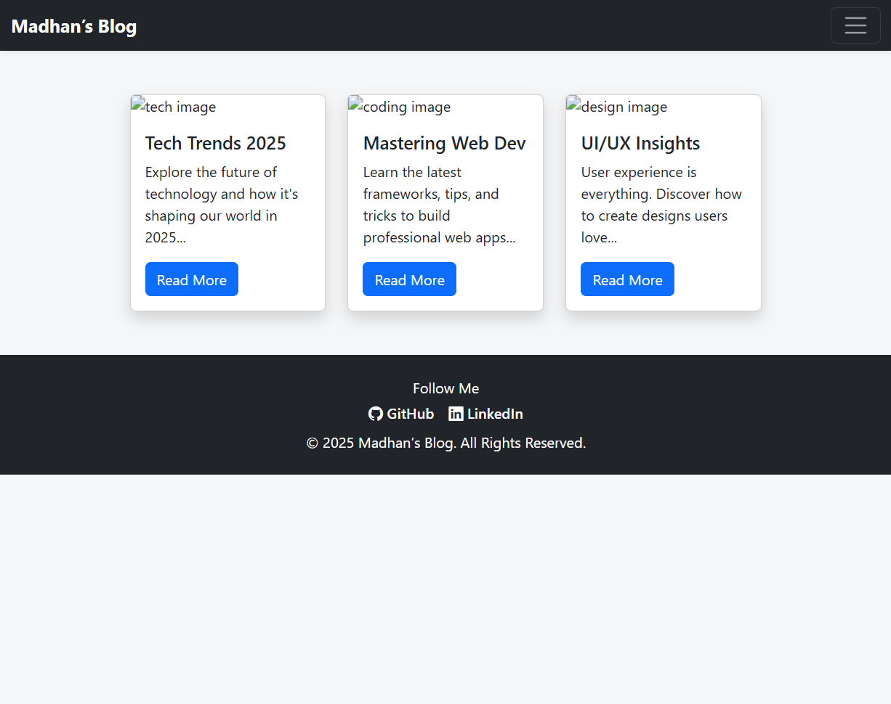

# 📰 Task 8 – Responsive Blog Layout Using Bootstrap 5

🌐 **Live Demo:** [Click here to view the project](https://madhankumar1701.github.io/Blog-Layout/)

---

## 📋 Description

This project is a fully responsive **blog layout** created using **Bootstrap 5** via **CDN**, as part of my web development internship (Task 8). The goal was to learn and implement key Bootstrap components and layout strategies to rapidly build a clean, professional UI.

The layout includes:
- 🌐 **Sticky & Responsive Navbar**
- 🧱 **Card-based Blog Layout using Bootstrap Grid System**
- 🎨 **Modern Design with Smooth Hover Shadow Effects**
- 🦾 **Footer with Social Media Icons**
- ⚙️ **Responsive design tested across multiple devices**

---

## 🎯 Objective

Create a responsive **blog page** using Bootstrap 5 CDN, showcasing proper use of components, grid system, and utility classes to meet UI/UX expectations for modern websites.

---

## 🛠️ Tools & Technologies Used

| Tool | Purpose |
|------|---------|
| **HTML5** | Structure of the webpage |
| **CSS3** | Custom styling and layout improvements |
| **Bootstrap 5 (via CDN)** | Rapid UI development, grid layout, components |
| **Bootstrap Icons (via CDN)** | Footer social media icons |
| **VS Code** | Code editor used for development |
| **Browser DevTools** | Testing responsiveness across breakpoints |

---

## 📦 Features Implemented

- ✅ **Sticky Navbar** using Bootstrap component
- ✅ **Responsive Card Layout** using Bootstrap Grid
- ✅ **Smooth hover shadows** for interactivity and polish
- ✅ **Social Media Footer with Icons**
- ✅ **Clean typography and spacing** using Bootstrap utility classes
- ✅ **Responsive design** verified across breakpoints
- ✅ **All components styled using Bootstrap only (no JS frameworks)**

---

## 🔑 Key Concepts Applied

- ✅ **Bootstrap 5**: CSS framework used for layout and UI components
- ✅ **CDN**: Bootstrap and icon libraries loaded via CDN for performance
- ✅ **Grid System**: `container`, `row`, and `col-md-*` used for responsive structure
- ✅ **Components**: Navbar, Cards, Footer, Buttons
- ✅ **Utility Classes**: Used for margins, padding, shadows, font-weight, responsiveness

---

## 📷 Screenshot

> Screenshot of the blog layout:

---

## 📱 Responsiveness Testing

Tested on:
- 📱 **Mobile** (360px)
- 📱 **Tablet** (768px)
- 💻 **Desktop** (1920px+)

Used browser dev tools to simulate different devices and ensure adaptive layout across breakpoints.
